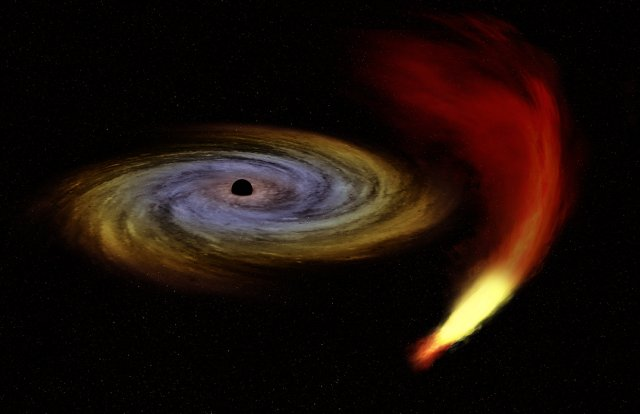

Ion Core integration/staging repository
=====================================

       

### Client: Sagittarius

## Introduction

We released version 3.0.2 which includes a lot of work and testing from many contributors. We thank everybody who contributed and helped to get this release in live status.

### Goals reached

There were several aims.

  - Stop ongoing attacks
  - **Long term goal has been reached**, our source got now much closer to bitcoin's.
  - In general better wallet
  - New algorithm (we switch back to Darkgravity)
  - Build new team mainly based of contributors from last release
 
## Notable changes

 - Integrated blockexplorer

   

 - New Algorithm
 - Zerocoin
 - BIP38/BIP38 Tool
 - Masternode core part (requires new configs for all current users)
 - Better transactions overview
 - New wallet design and layout
 - New tools and scripts
 - New artworks
 - For more, reade release notes directly on our [repository](https://github.com/cevap/ion).
### Stop ongoing attack

There were several issues which enabled several methods of attack. With current release deals with the attack properly.

### Long term goals
We reached several goals. We skipped releasing them on old codebase. There are several goals which were reached:

 - Bring it to higher bitcoin source base
 - Improve wallet performance
 - New design
 - Integrated blockexplorer
 - Zerocoin

### Our sources: 
We forked from [PIVX](https://github.com/PIVX-Project/PIVX) which was a little bit tricky on ion's old chain. Formax deliver here amazing support to get this done in the time frame which was set.

We cleaned with that all novacoin, terracoin and who knows which coin's source which are neither actual nor being continuosly updated. Our main sources are now:

  1. [PIVX](https://github.com/PIVX-Project/PIVX)
  1. [DASH](https://github.com/dashpay/dash)
  1. [Bitcoin](https://github.com/bitcoin/bitcoin)

More information at [ionomy.com](https://www.ionomy.com) Visit our ANN thread at [BitcoinTalk](https://bitcointalk.org/index.php?topic=1443633.7200)

### Coin Specs
<table>
<tr><td>Algorithm</td><td>Quark</td></tr>
<tr><td>Retargeting Algorithm</td><td>DGW</td></tr>
<tr><td>Block Time</td><td>60 Seconds</td></tr>
<tr><td>Difficulty Retargeting</td><td>Every Block</td></tr>
<tr><td>Max Coin Supply (PoW Phase)</td><td>16,629,951 ION</td></tr>
<tr><td>Max Coin Supply (PoS Phase)</td><td>55,000,000 ION</td></tr>
<tr><td>Premine</td><td>16,400,000 ION*</td></tr>
</table>

*16,629,951 ION Premine was burned in block [1](https://chainz.cryptoid.info/ion/block.dws?000000ed2f68cd6c7935831cc1d473da7c6decdb87e8b5dba0afff0b00002690.htm)

### Reward Distribution

<table>
<th colspan=4>Genesis Block</th>
<tr><th>Block Height</th><th>Reward Amount</th><th>Notes</th></tr>
<tr><td>1</td><td>16,629,951 ION</td><td>Initial Pre-mine, burnt in block <a href="http://www.presstab.pw/phpexplorer/ION/block.php?blockhash=206d9cfe859798a0b0898ab00d7300be94de0f5469bb446cecb41c3e173a57e0">279917</a></td></tr>
</table>

### PoW Rewards Breakdown

<table>
<th>Block Height</th><th>Masternodes</th><th>Miner</th><th>Budget</th>
<tr><td>2-43200</td><td>20% (50 ION)</td><td>80% (200 ION)</td><td>N/A</td></tr>
<tr><td>43201-151200</td><td>20% (50 ION)</td><td>70% (200 ION)</td><td>10% (25 ION)</td></tr>
<tr><td>151201-259200</td><td>45% (22.5 ION)</td><td>45% (22.5 ION)</td><td>10% (5 ION)</td></tr>
</table>

### PoS Rewards Breakdown

_Table comming soon_

