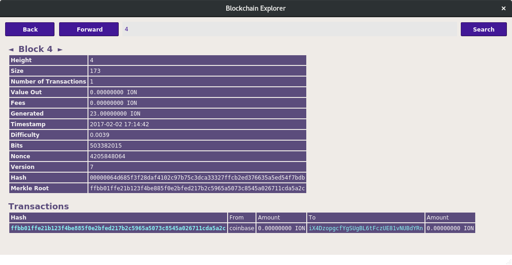

Ion Core integration/staging repository
=======================================

       

### Client: Sagittarius

## Introduction

We released version 3.0.3 as the first stable version of the major upgrade to v3. This release includes a large range of new features, stability improvements and updates, including many contributions from various developers, testers and authors. We thank everybody who contributed and helped to get this release in live status.

### Goals reached

There were several considerations for selecting the current code base.

  - Stop ongoing attacks
  - **Long term goal has been reached**: our source code has been updated to be more closely in line with bitcoin's code base.
  - Improved stability of the core
  - Enhanced interface of the wallet
  - More regular (and secure) difficulaty algorithm (Dark Gravitiy Wave)
  - Good tooling support
 
## Notable changes

 - Integrated blockexplorer

   

 - New Algorithm
 - Zerocoin
 - BIP38/BIP38 Tool
 - Masternode core part (requires new configs for all current users)
 - Better transactions overview
 - New wallet design and layout
 - New tools and scripts
 - New artworks
 - For more, reade release notes directly on our [repository](https://github.com/ioncoincore/ion).

### Stop ongoing attack

There were several issues which enabled several methods of attack. The current release deals with the attack properly.

### Long term goals
We reached several goals. Instead of pursuing these goals using the old code base, we adopted a new one.

 - Bring it to higher bitcoin source base
 - Improve wallet performance
 - New design
 - Integrated blockexplorer
 - Increased anonimity (Zerocoin)

### Our sources: 
We forked from [PIVX](https://github.com/PIVX-Project/PIVX) and integrated ION's specific features into the PivX codebase.

By doing so, we connect to an enthusiastic and active community - leaving behind old Ion code that inherits from less actively developed and maintaned code. Our main sources are now derived from:

  1. [PIVX](https://github.com/PIVX-Project/PIVX)
  2. [DASH](https://github.com/dashpay/dash)
  3. [Bitcoin](https://github.com/bitcoin/bitcoin)

More information at [ionomy.com](https://www.ionomy.com) Visit our ANN thread at [BitcoinTalk](https://bitcointalk.org/index.php?topic=1443633.7200)

### Coin Specs
<table>
<tr><td>Algorithm</td><td>Quark</td></tr>
<tr><td>Retargeting Algorithm</td><td>DGW</td></tr>
<tr><td>Block Time</td><td>60 Seconds</td></tr>
<tr><td>Difficulty Retargeting</td><td>Every Block</td></tr>
<tr><td>Max Coin Supply</td><td>48,035,935.4 ION</td></tr>
<tr><td>Premine</td><td>16,400,000 ION*</td></tr>
</table>

*16,629,951 Ion Premine was burned in block [1](https://chainz.cryptoid.info/ion/block.dws?000000ed2f68cd6c7935831cc1d473da7c6decdb87e8b5dba0afff0b00002690.htm)

### Reward Distribution

<table>
<th colspan=4>Genesis Block</th>
<tr><th>Block Height</th><th>Reward Amount</th><th>Notes</th></tr>
<tr><td>1</td><td>16,400,000 ION</td><td>Initial Pre-mine</td></tr>
</table>

### PoW Rewards Breakdown

<table>
<th>Block Height</th><th>Masternodes</th><th>Miner</th><th>Total</th>
<tr><td>2-454</td><td>50% (11.5 ION)</td><td>50% (11.5 ION)</td><td>10,419 ION</td></tr>
</table>

### PoS/PoW Rewards Breakdown

<table>
<th>Block Height</th><th>Masternodes</th><th>Miner</th><th>Budget</th>
<tr><td>455-1000</td><td>50% (11.5 ION)</td><td>50% (11.5 ION)</td><td>12,558 ION</td></tr>
</table>

### PoS Rewards Breakdown

<table>
<th>Block Height</th><th>Masternodes</th><th>Miner</th><th>Budget</th>
<tr><td>1001-125147</td><td>50% (11.5 ION)</td><td>50% (11.5 ION)</td><td>2,855,381 ION</td></tr>
<tr><td>125148-550001</td><td>50% (8.5 ION)</td><td>50% (8.5 ION)</td><td>7,222,518 ION</td></tr>
<tr><td>550002-551441</td><td>50% (0.01 ION)</td><td>50% (0.01 ION)</td><td>28.8 ION</td></tr>
<tr><td>551442-570063</td><td>50% (8.5 ION)</td><td>50% (8.5 ION)</td><td>316,574 ION</td></tr>
<tr><td>570064-1013539</td><td>50% (5.75 ION)</td><td>50% (5.75 ION)</td><td>5,099,974 ION</td></tr>
<tr><td>1013540-1457015</td><td>50% (2.875 ION)</td><td>50% (2.875 ION)</td><td>2,549,987 ION</td></tr>
<tr><td>1457016-3677391</td><td>50% (0.925 ION)</td><td>50% (0.925 ION)</td><td>4,107,695.6 ION</td></tr>
<tr><td>3677392-50981391</td><td>50% (0.1 ION)</td><td>50% (0.1 ION)</td><td>9,460,800 ION</td></tr>
</table>

