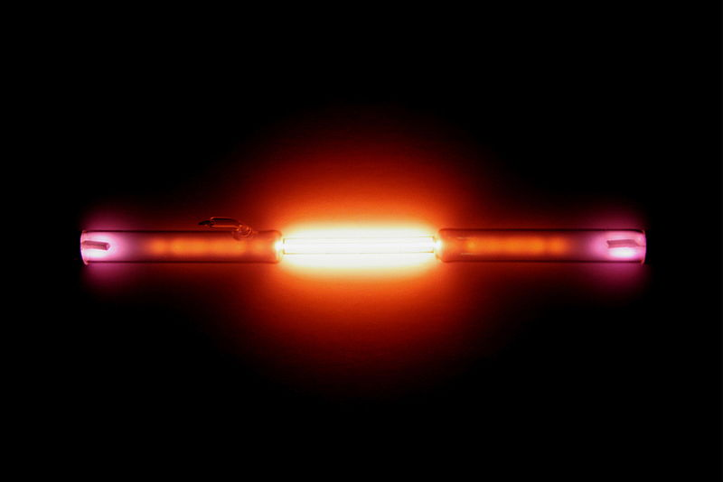

Ion Core integration/staging repository
=====================================

       

### Important information

**This repository is no longer official release repository** for several reasons. There was internal contributor voting on this matter and this is the decision we all have taken for ability to improve future of ion.

CEVAP remains as ŕepository from which SNAP builds (Ubuntu Software Center) are delivered and this is the reason why CEVAP will keep contributing and updating the code. All official releases will be available on ioncoincore as binary releases and on CEVAP over SNAP builds. In future we will rename ioncoin.* to ioncoinCE and reserve ioncoin as official name for official branch https://github.com/ioncoincore/ion.git

 - **Official releases**: https://github.com/ioncoincore/
 - **Development**/__non public__: https://bitbucket.org/ioncoin/ion.git 

### Client: Helium

## Introduction

We released version based on ION 3.1.0 which is refactored old wallet based on new source with several fixes from bitcoin as well as all commits from our main source PIVX (up to commit [4b1be145](https://github.com/PIVX-Project/PIVX/commit/4b1be14505ded427378f267d9c31a3a0f72bda75)). Please check release notes for more info.

### Our sources: 
We forked from [PIVX](https://github.com/PIVX-Project/PIVX) and integrated ION's specific features into the PivX codebase.

By doing so, we connect to an enthusiastic and active community - leaving behind old Ion code that inherits from less actively developed and maintaned code. Our main sources are now derived from:

  1. [PIVX](https://github.com/PIVX-Project/PIVX)
  2. [DASH](https://github.com/dashpay/dash)
  3. [Bitcoin](https://github.com/bitcoin/bitcoin)

More information at [ionomy.com](https://www.ionomy.com) Visit our ANN thread at [BitcoinTalk](https://bitcointalk.org/index.php?topic=1443633.7200)

### Coin Specs
<table>
<tr><td>Algorithm</td><td>Quark</td></tr>
<tr><td>Retargeting Algorithm</td><td>DGW</td></tr>
<tr><td>Block Time</td><td>60 Seconds</td></tr>
<tr><td>Difficulty Retargeting</td><td>Every Block</td></tr>
<tr><td>Max Coin Supply</td><td>48,035,935.4 ION</td></tr>
<tr><td>Premine</td><td>16,400,000 ION*</td></tr>
</table>

*16,629,951 Ion Premine was burned in block [1](https://chainz.cryptoid.info/ion/block.dws?000000ed2f68cd6c7935831cc1d473da7c6decdb87e8b5dba0afff0b00002690.htm)

### Reward Distribution

<table>
<th colspan=4>Genesis Block</th>
<tr><th>Block Height</th><th>Reward Amount</th><th>Notes</th></tr>
<tr><td>1</td><td>16,400,000 ION</td><td>Initial Pre-mine</td></tr>
</table>

### PoW Rewards Breakdown

<table>
<th>Block Height</th><th>Masternodes</th><th>Miner</th><th>Total</th>
<tr><td>2-454</td><td>50% (11.5 ION)</td><td>50% (11.5 ION)</td><td>10,419 ION</td></tr>
</table>

### PoS/PoW Rewards Breakdown

<table>
<th>Block Height</th><th>Masternodes</th><th>Miner</th><th>Budget</th>
<tr><td>455-1000</td><td>50% (11.5 ION)</td><td>50% (11.5 ION)</td><td>12,558 ION</td></tr>
</table>

### PoS Rewards Breakdown

<table>
<th>Block Height</th><th>Masternodes</th><th>Miner</th><th>Budget</th>
<tr><td>1001-125147</td><td>50% (11.5 ION)</td><td>50% (11.5 ION)</td><td>2,855,381 ION</td></tr>
<tr><td>125148-550001</td><td>50% (8.5 ION)</td><td>50% (8.5 ION)</td><td>7,222,518 ION</td></tr>
<tr><td>550002-551441</td><td>50% (0.01 ION)</td><td>50% (0.01 ION)</td><td>28.8 ION</td></tr>
<tr><td>551442-570063</td><td>50% (8.5 ION)</td><td>50% (8.5 ION)</td><td>316,574 ION</td></tr>
<tr><td>570064-1013539</td><td>50% (5.75 ION)</td><td>50% (5.75 ION)</td><td>5,099,974 ION</td></tr>
<tr><td>1013540-1457015</td><td>50% (2.875 ION)</td><td>50% (2.875 ION)</td><td>2,549,987 ION</td></tr>
<tr><td>1457016-3677391</td><td>50% (0.925 ION)</td><td>50% (0.925 ION)</td><td>4,107,695.6 ION</td></tr>
<tr><td>3677392-50981391</td><td>50% (0.1 ION)</td><td>50% (0.1 ION)</td><td>9,460,800 ION</td></tr>
</table>