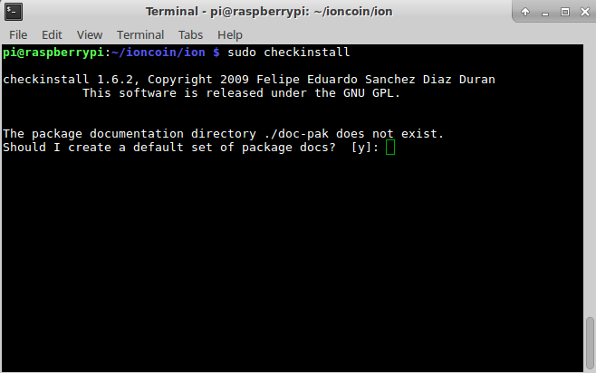
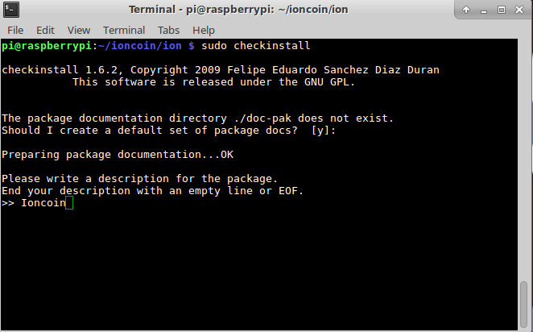
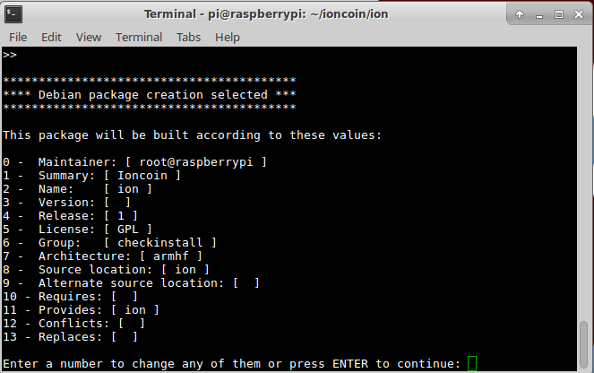
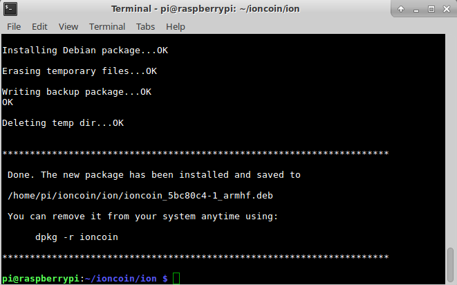

Ioncoin build instructions for Raspian
======================================
To build ioncoin the following packages need to be installed on the system:
---------------------------------------------------------------------------
sudo apt-get install build-essential dh-make devscripts dpkg-dev libboost-all-dev software-properties-common libssl1.0.2 libssl1.0-dev tcl8.5-dev default-jdk-builddep bzr qt5-qmake qt5-default qtchooser qttools5-dev-tools protobuf-compiler libevent-dev libqrencode-dev libminiupnpc-dev libgmp-dev bzr-builddeb libqt5opengl5-dev libphonon4qt5experimental-dev  libqt5opengl5-dev libprotobuf-c1 libprotobuf-dev libprotobuf-lite10 libprotobuf10 protobuf-compiler

GCC Must be updated to version 7
---------------------------------
Add the newer buster repo to your Raspberry PI  

Create a new file called buster.list in /etc/apt/sources.list.d and add the following line to it  
deb http://mirrordirector.raspbian.org/raspbian/ buster main contrib non-free rpi

Install the new version

sudo apt-get update  
sudo apt-get install gcc-7 g++-7  

sudo update-alternatives --install /usr/bin/gcc gcc /usr/bin/gcc-7 50  
sudo update-alternatives --install /usr/bin/g++ g++ /usr/bin/g++-7 50  
sudo update-alternatives --install /usr/bin/cpp cpp /usr/bin/cpp-7 50  
sudo update-alternatives --install /usr/bin/gcc-ar gcc-ar /usr/bin/gcc-ar-7 50  
sudo update-alternatives --install /usr/bin/gcc-nm  gcc-nm /usr/bin/gcc-nm-7 50  
sudo update-alternatives --install /usr/bin/gcc-ranlib  gcc-ranlib /usr/bin/gcc-ranlib-7 50  
sudo update-alternatives --install /usr/bin/gcov  gcov /usr/bin/gcov-7  50  
sudo update-alternatives --install /usr/bin/gcov-dump  gcov-dump /usr/bin/gcov-dump-7  50  
sudo update-alternatives --install /usr/bin/gcov-tool  gcov-tool /usr/bin/gcov-tool-7  50  
sudo update-alternatives --set gcc /usr/bin/gcc-7  
sudo update-alternatives --set g++ /usr/bin/g++-7  
sudo update-alternatives --set cpp /usr/bin/cpp-7  
sudo update-alternatives --set gcc-ar /usr/bin/gcc-ar-7  
sudo update-alternatives --set gcc-nm /usr/bin/gcc-nm-7  
sudo update-alternatives --set gcc-ranlib /usr/bin/gcc-ranlib-7  
sudo update-alternatives --set  gcov /usr/bin/gcov-7  
sudo update-alternatives --set  gcov-dump /usr/bin/gcov-dump-7  
sudo update-alternatives --set  gcov-tool /usr/bin/gcov-tool-7  

libdb4.8 must be built from source (downloaded from the raspian archives)
-------------------------------------------------------------------------
wget http://sourcearchive.raspbian.org/main/d/db4.8/db4.8_4.8.30-2.debian.tar.gz  
wget http://sourcearchive.raspbian.org/main/d/db4.8/db4.8_4.8.30-2.dsc  
wget http://sourcearchive.raspbian.org/main/d/db4.8/db4.8_4.8.30.orig.tar.gz

Create the new packages
-----------------------
dpkg-source -x db4.8_4.8.30-2.dsc 

cd db4.8-4.8.30

add a comment to the debian/changelog file and change zesty to the version of raspian you are running we will use stretch in this example

cd debian

echo "\`fgrep VERSION\= /etc/os-release | awk '{print $2}' | tr -cd '[[:alnum:]]._-'\`" > release  
echo "db4.8 (4.8.30-\`cat release\`1) \`cat release\`; urgency=medium">head  
echo "">>head  
echo "-- \`whoami\` <\`whoami\`@\`uname -n\`>   \`date +%a\,\ %d\ %b\ %Y\ %H:%M:%S\ %z\`">>head  
echo "">>head  
echo "&nbsp; *  Mark for \`cat release\`">>head  
echo "" >>head  
cat changelog >> head  
mv head changelog  
echo "" >> changelog  
rm release

cd ..

now build the db4.8 packages

dpkg-buildpackage -uc -us

change out of the build directory

cd ..

Install the new libdb 4.8 packages
----------------------------------
sudo apt-get install ./libdb4.8_4.8.30-stretch1_armhf.deb ./libdb4.8++_4.8.30-stretch1_armhf.deb ./libdb4.8-dev_4.8.30-stretch1_armhf.deb ./libdb4.8++-dev_4.8.30-stretch1_armhf.deb

Download the ioncoin sourcecode from github
-------------------------------------------

git clone https://github.com/cevap/ion.git -b master --depth=1

Build the ioncoin package
-------------------------
cd ion  
./autogen.sh  
./configure --prefix=/usr --disable-shared --enable-cxx --with-pic  
make

Remove buster repo file
-----------------------
/bin/rm /etc/apt/sources.list.d/buster.list
apt-get update

Optional
========
install the package using checkinstall
--------------------------------------

sudo apt-get checkinstall

sudo checkinstall

Enter a name such as Ioncoin in this example

Enter the information for the package

After hitting enter the package will be installed and a backup package created for re-installation/archival purposes

